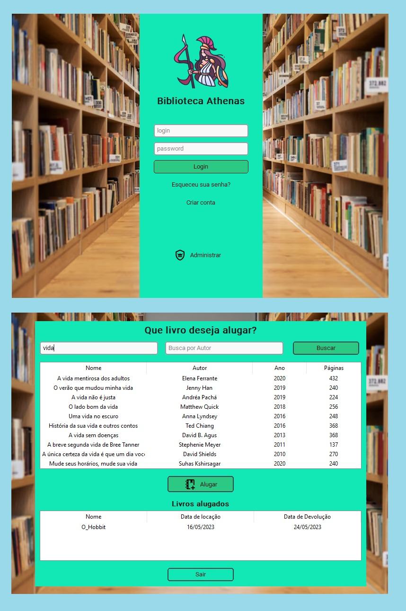
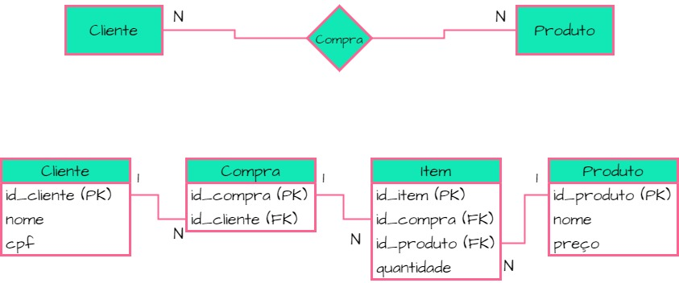

##  Atividades Individuais 💻 

  <strong>Criação de software de gerenciamento de Biblioteca</strong>

  <strong>Diagramas do slide Modelagem de Dados</strong>

<strong>Exercícios do slide Introdução à Banco de Dados</strong> 
 O código SQL referente a criação das tabelas se encontra neste repositorio com o nome de: 
 "Atividade individual 02 - SQL.py

<strong>Aluno:</strong> 
Bruno Vieira Santana
  

